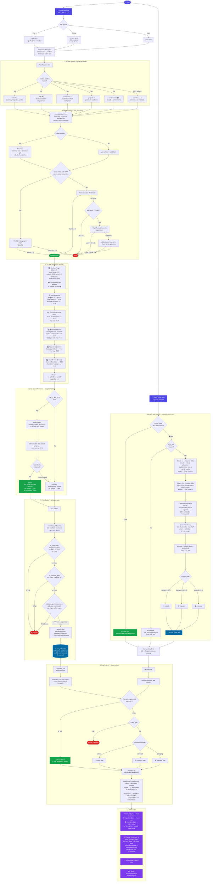

# SkillBridge — Complete Process Flowchart

```mermaid
flowchart TD
    %% ============================================================
    %% INPUTS
    %% ============================================================
    U([👤 User]) --> RA[📄 Upload Resume\nPDF / DOCX / TXT]
    U --> RT[🎯 Select Target Role\ne.g. Data Scientist]

    %% ============================================================
    %% STAGE 1 — TEXT EXTRACTION
    %% ============================================================
    RA --> TX{File Type?}
    TX -- PDF --> PX[pdfplumber\npage-by-page extraction]
    TX -- DOCX --> DX[python-docx\nparagraph join]
    TX -- TXT --> FX[plain read]
    PX & DX & FX --> TN[Normalize whitespace\ncollapse tabs & newlines\nlowercase entire text]
    TN --> ST

    %% ============================================================
    %% STAGE 2 — SECTION SPLITTING
    %% ============================================================
    subgraph SEC["📂 Section Splitting  —  split_sections()"]
        ST[Raw Resume Text] --> SH{Section headers\nfound?}
        SH -- Yes --> S1[about 📝\nsummary / objective / profile]
        SH -- Yes --> S2[skills 🛠️\ntechnical skills / competencies]
        SH -- Yes --> S3[experience 💼\nwork / internship / employment]
        SH -- Yes --> S4[projects 🔨\npersonal / academic]
        SH -- Yes --> S5[certifications 🏆\nawards / achievements]
        SH -- No → fallback --> S6[unsectioned 📃\nentire text as one block]
    end

    %% ============================================================
    %% STAGE 3 — SKILL MATCHING
    %% ============================================================
    S1 & S2 & S3 & S4 & S5 & S6 --> NL

    subgraph MATCH["🔍 Skill Matching  —  skill_matches()"]
        NL[normalize each line\nlowercase → remove special chars\n hyphens become spaces] --> TK
        TK{Skills section?} -- Yes --> EX[Tokenize:\ncomma / pipe / semicolon split\n+ individual word tokens]
        TK -- No --> EX2[Use full line + sub-tokens]
        EX & EX2 --> FM

        FM{Exact-match-only skill?\nr, c, go, scala, flask, rust...} -- Yes --> EB[Word boundary regex ONLY\n\\bskill\\b]
        FM -- No --> WB[Word boundary check first]
        WB -- found → ✅ --> MR([Skill Matched])
        WB -- not found --> FZ{skill length ≥ 5 chars?}
        FZ -- No → ❌ --> SKIP([Skip])
        FZ -- Yes --> RF[RapidFuzz partial_ratio\nagainst text]
        RF -- score < 90 → ❌ --> SKIP
        RF -- score > 90 --> VB[Validate word boundaries\ncheck left & right chars]
        VB -- invalid → ❌ --> SKIP
        VB -- valid → ✅ --> MR
        EB -- found → ✅ --> MR
        EB -- not found → ❌ --> SKIP
    end

    %% ============================================================
    %% STAGE 4 — 6-LAYER PROFICIENCY SCORING
    %% ============================================================
    MR --> L1

    subgraph SCORE["⚖️ 6-Layer Proficiency Scoring"]
        L1["1️⃣  Section Weight\nskills=0.45  experience=0.30\nprojects=0.30  certs=0.15\nabout=0.10  unsectioned=0.20\n\n★ Accumulates if skill appears\n  in multiple sections ★"]
        L1 --> L2["2️⃣  Context Boost\nexpert in X  → +0.10\nproficient in X → +0.08\nstrong X / skilled in X → +0.05"]
        L2 --> L3["3️⃣  Occurrence Count Boost\n+0.03 per mention in full text\nmax cap  +0.15"]
        L3 --> L4["4️⃣  Action Verb Boost\ndeveloped / built / trained /\napplied / implemented near skill\n+0.02 per verb  max +0.10"]
        L4 --> L5["5️⃣  Years of Experience\n3 years of Python → +0.12\nmax cap  +0.20"]
        L5 --> L6["6️⃣  Multi-Section Diversity\nfound in 2 sections → +0.05\nfound in 3+ sections → +0.10"]
        L6 --> FP["final = L1+L2+L3+L4+L5+L6\ncapped at 1.0"]
    end

    %% ============================================================
    %% STAGE 5 — GROQ LLM REFINEMENT
    %% ============================================================
    FP --> GA{GROQ_API_KEY\nset?}

    subgraph LLM["🤖 Groq LLM Refinement  —  GroqSkillRefiner"]
        GA -- Yes --> GP[Build prompt:\nresume text first 6000 chars\n+ heuristic skill scores]
        GP --> GC[Call llama-3.3-70b-versatile\ntemp=0.1  max_tokens=2048]
        GC --> GR{Valid JSON\nreturned?}
        GR -- Yes --> GM["Merge:\nLLM score overrides heuristic\nllm_refined = True\nllm_reasoning saved"]
        GR -- Error/Timeout --> GF[Fallback:\nkeep heuristic scores\nllm_refined = False]
        GA -- No --> GF
    end

    GM & GF --> FG

    %% ============================================================
    %% STAGE 6 — FILTER GATES & DB SAVE
    %% ============================================================
    subgraph FILTER["🚦 Filter Gates  —  skills.py router"]
        FG[Raw skill list] --> FN[normalize_skill_name\nstrip brackets, lowercase\nhyphenate spaces]
        FN --> FV{is_valid_skill?\nlength 1-40 chars\nno URLs, no dates\n≤4 words}
        FV -- ❌ Fail --> DROP([🗑️ Discard])
        FV -- ✅ Pass --> FT{is_technical_skill?\nnot in 30+ soft skills set}
        FT -- ❌ Fail --> DROP
        FT -- ✅ Pass --> FX2{validate_against_taxonomy\nskills.json exact match\nthen fuzzy ≥85% match}
        FX2 -- ❌ Unknown --> DROP
        FX2 -- ✅ Known → canonical name --> RE[reunify_skills\nmerge fragments:\nexporatory+analysis\n→ exploratory-data-analysis]
        RE --> DB[(💾 user_skills table\nskill_name · proficiency\nconfidence · sources\nllm_refined)]
    end

    %% ============================================================
    %% STAGE 7 — MARKET SKILL SEARCH
    %% ============================================================
    RT --> MC{Cache exists\n& < 24 hours old?}

    subgraph MARKET["🌐 Market Skill Search  —  MarketSkillSearcher"]
        MC -- ✅ Hit --> CH[📦 Load from\napp/data/skills_cache/role.json]
        MC -- ❌ Miss --> AK{Tavily API\nkey set?}
        AK -- No --> FB[📚 Fallback:\nrole_requirements.json\nstatic role data]
        AK -- Yes --> TS1["Search 1 — Required Skills\nlinkedin · indeed · glassdoor\nstackoverflow · dev.to\nmax 10 results\nweight = ×2 per mention"]
        TS1 --> TS2["Search 2 — Trending Skills\n2025 / 2026 emerging tech\nmax 5 results\nweight = ×1 per mention"]
        TS2 --> ME[Extract mentions from results\nword boundary match against\n200+ hardcoded known_skills]
        ME --> MN[Normalize aliases:\nk8s→kubernetes  nlp→NLP\nsklearn→scikit-learn  js→javascript]
        MN --> MD[demand = mention_count / max_count\nrange 0.0 – 1.0]
        MD --> CL{Classify level}
        CL -- demand ≥ 0.70 --> CR[🔴 critical]
        CL -- demand 0.40-0.69 --> CI[🟡 important]
        CL -- demand < 0.40 --> CE[🟢 emerging]
        CR & CI & CE --> CA[💾 Cache to file 24h]
    end

    CH & FB & CA --> MS[Market Skills Dict\nskill → frequency / level / trending]

    %% ============================================================
    %% STAGE 8 — GAP ANALYSIS
    %% ============================================================
    DB --> US[User Skills Dict\nfrom database]
    MS --> GA2

    subgraph GAP["⚖️ Gap Analysis  —  GapAnalyzer"]
        US --> NA[Normalize user skill names\nlowercase + synonym resolution]
        GA2[Market Skills] --> NB[Normalize market skill names]
        NA & NB --> CMP{For each market skill:\nuser has it?}
        CMP -- ✅ Yes --> STR["➕ STRENGTH\n+ user_proficiency shown"]
        CMP -- ❌ No --> SKF{Is soft skill?}
        SKF -- Yes --> IGN([Ignore — filtered])
        SKF -- No --> LVL{requirement_level?}
        LVL -- critical --> CG[🔴 critical_gap]
        LVL -- important --> IG[🟡 important_gap]
        LVL -- emerging --> EG[🟢 emerging_gap]

        CG & IG & EG & STR --> SORT[Sort each list\nby demand descending]
        SORT --> RS["Readiness Score Formula:\nweight = demand × multiplier\n  critical = ×3  important = ×2  emerging = ×1\n\nreadiness = Σ(weight of skills user HAS)\n            ÷ Σ(weight of ALL market skills)"]
    end

    %% ============================================================
    %% OUTPUT
    %% ============================================================
    RS --> OUT

    subgraph OUT["📋 Final Output"]
        O1["🔴 Critical Gaps  — must learn now\n🟡 Important Gaps — learn soon\n🟢 Emerging Gaps — future skills\n✅ Strengths — already have these"]
        O2["📊 Overall Readiness %\n≥80% Excellent match\n60–80% Good — fill a few gaps\n40–60% Moderate — significant learning\n<40% Start from foundations"]
        O3["🎯 Top 3 Priority Skills to Learn"]
        O4["📚 Course Recommendations\nper missing skill"]
    end

    %% ============================================================
    %% Styling
    %% ============================================================
    classDef input fill:#4f46e5,color:#fff,stroke:#4338ca
    classDef stage fill:#0f172a,color:#e2e8f0,stroke:#334155
    classDef good fill:#16a34a,color:#fff,stroke:#15803d
    classDef bad fill:#dc2626,color:#fff,stroke:#b91c1c
    classDef db fill:#0369a1,color:#fff,stroke:#0284c7
    classDef out fill:#7c3aed,color:#fff,stroke:#6d28d9

    class U,RA,RT input
    class MR,GM,STR,CH,CA good
    class SKIP,DROP,IGN bad
    class DB,CA db
    class O1,O2,O3,O4 out
```
