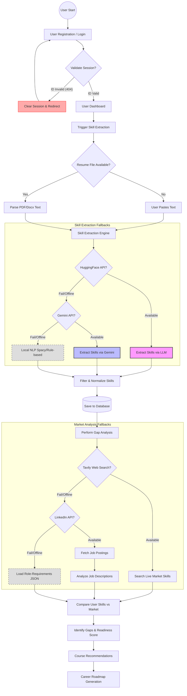

# SkillBridge Project Flow Diagram

This diagram illustrates the core process of the SkillBridge application, from user onboarding to skill gap analysis and recommendations, highlighting the multi-layered fallback mechanisms.

### Process Highlights & Fallbacks

| Feature | Primary Method | Secondary Fallback | Basic Fallback |
| :--- | :--- | :--- | :--- |
| **Authentication** | Valid Session | — | Automatic Logout & Redirect |
| **Skill Extraction** | HuggingFace LLM | Google Gemini AI | Spacy / Rule-based NLP |
| **Market Data** | Tavily Live Web Search | LinkedIn Job Scraper | Static `role_requirements.json` |
| **Course Discovery** | API Search | — | Static Recommendations |

> [!NOTE]
> The **Skill Extraction Engine** uses a unified service that automatically attempts the most sophisticated method available before falling back to simpler, local logic.
